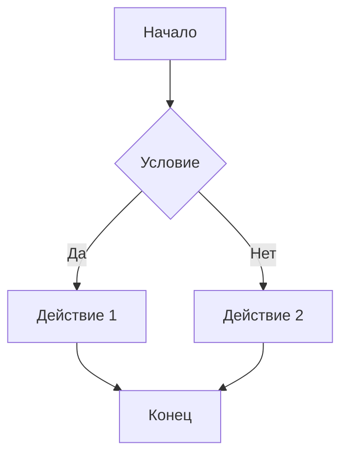
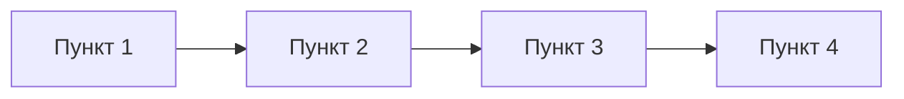
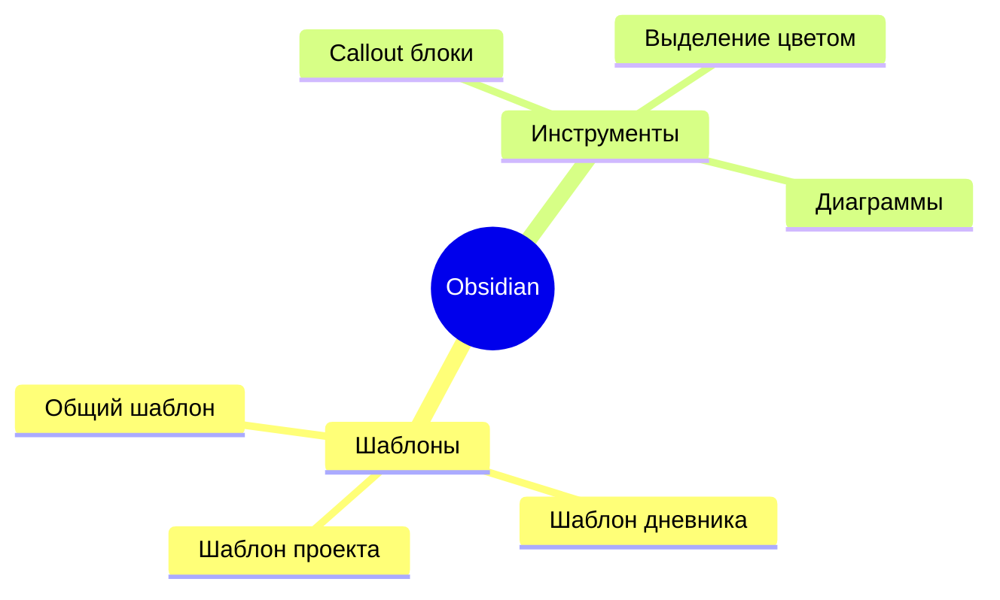
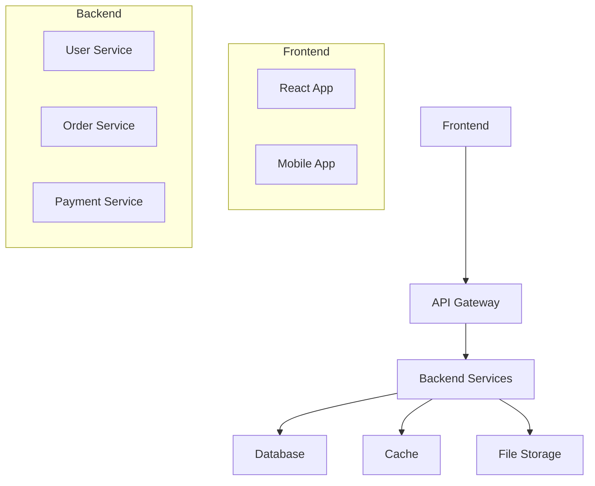

# 🚀 Шаблон продвинутых инструментов

## 📋 Описание
Этот шаблон содержит продвинутые инструменты Obsidian для создания сложных и красивых заметок.

---

## 📊 Диаграммы и графики

### 🔄 Mermaid диаграммы


### 📈 График


### 👥 Диаграмма связей


---

## 🧮 Математические формулы

### 📐 LaTeX формулы
Встроенная формула: $E = mc^2$

Блочная формула:
$$
\int_{-\infty}^{\infty} e^{-x^2} dx = \sqrt{\pi}
$$

### 📊 Таблица с формулами
| Формула | Описание |
|---------|----------|
| $a^2 + b^2 = c^2$ | Теорема Пифагора |
| $F = ma$ | Второй закон Ньютона |
| $PV = nRT$ | Уравнение состояния газа |

---

## 📎 Вложения и медиа

### 🖼️ Изображения


### 🎥 Видео


### 📄 PDF
![[документ.pdf]]

### 🎵 Аудио
![[аудиофайл.mp3]]

---

## 🔗 Продвинутые ссылки

### 📌 Внутренние ссылки с текстом
[[Общий шаблон|Ссылка на общий шаблон]]

### 📌 Ссылки на заголовки
[[Общий шаблон#📋 Описание]]

### 📌 Ссылки на блоки
[[Общий шаблон#^блок-идентификатор]]

### 🔗 Внешние ссылки с описанием
[Google](https://google.com "Поисковая система")

---

## 📋 Продвинутые списки

### ✅ Задачи с датами
- [ ] Задача 1 📅 2024-01-15
- [x] Задача 2 ✅ 2024-01-10
- [ ] Задача 3 📅 2024-01-20

### 📊 Список с прогрессом
- [ ] Шаг 1 (0%)
- [x] Шаг 2 (50%)
- [ ] Шаг 3 (100%)

### 🎯 Список с приоритетами
- 🔴 Высокий приоритет
- 🟡 Средний приоритет  
- 🟢 Низкий приоритет

---

## 🎨 Продвинутое форматирование

### 📝 Цитаты с источником
> Цитата из текста
> 
> — **Автор**, *Источник*

### 💻 Код с подсветкой синтаксиса
```python
def hello_world():
    print("Hello, World!")
    return True
```

```javascript
function greet(name) {
    return `Hello, ${name}!`;
}
```

### 📊 Таблица с выравниванием
| Левый  | Центр  | Правый |
| :----- | :----: | -----: |
| Текст  | Текст  |  Текст |
| Данные | Данные | Данные |

---

## 🔍 Специальные символы

### ⚡ Эмодзи для категорий
- 🚀 Проекты
- 📚 Обучение
- 💡 Идеи
- ⚠️ Проблемы
- ✅ Решения

### 🎯 Специальные символы
- → Стрелка вправо
- ← Стрелка влево
- ↑ Стрелка вверх
- ↓ Стрелка вниз
- ↔ Двунаправленная стрелка
- ⚡ Молния
- 🔥 Огонь
- 💎 Алмаз

---

## 📝 Шаблоны для быстрого ввода

### 🎯 Быстрый шаблон задачи
- [ ] **Задача:** 
- 📅 **Дедлайн:** 
- 👤 **Ответственный:** 
- 🏷️ **Теги:** 
- 📝 **Описание:** 

### 📊 Быстрый шаблон встречи
**Дата:** 
**Участники:** 
**Повестка:** 
**Решения:** 
**Действия:** 

### 💡 Быстрый шаблон идеи
**Идея:** 
**Проблема:** 
**Решение:** 
**Ресурсы:** 
**Следующие шаги:** 

---

## 🎯 Как использовать

1. **Скопируйте** нужный блок
2. **Вставьте** в заметку
3. **Настройте** под свои нужды
4. **Замените** примеры реальным контентом

## 🔗 Связи
- [[Шаблон инструментов форматирования]]
- [[Общий шаблон]]

## 🏷️ Теги
#шаблон #продвинутые-инструменты #диаграммы #формулы #obsidian

---

## 💡 Пример использования

### 📝 Заполненный пример заметки с продвинутыми инструментами:

# Архитектура веб-приложения

## 📊 Структура проекта



## 🧮 Математические расчеты

### Расчет производительности
Среднее время ответа API: $T_{avg} = \frac{\sum_{i=1}^{n} T_i}{n}$

Где:
- $T_i$ - время ответа i-го запроса
- $n$ - количество запросов

### Формула нагрузки
Максимальная нагрузка: $L_{max} = \frac{C \times T}{R}$

Где:
- $C$ - количество соединений
- $T$ - время обработки запроса
- $R$ - время ответа

## 📋 Продвинутый список задач

### 🔴 Критические задачи
- [ ] Настройка мониторинга 📅 2024-01-20
- [ ] Оптимизация базы данных 📅 2024-01-22

### 🟡 Важные задачи  
- [x] Развертывание в продакшн ✅ 2024-01-15
- [ ] Написание документации 📅 2024-01-25

### 🟢 Обычные задачи
- [ ] Обновление зависимостей 📅 2024-01-30

## 📝 Цитаты и источники

> Архитектура - это искусство делать сложные вещи простыми
> 
> — **Мартин Фаулер**, *Patterns of Enterprise Application Architecture*

## 💻 Примеры кода

### Backend (Python/Django)
```python
from django.db import models
from django.contrib.auth.models import User

class Order(models.Model):
    user = models.ForeignKey(User, on_delete=models.CASCADE)
    total_amount = models.DecimalField(max_digits=10, decimal_places=2)
    created_at = models.DateTimeField(auto_now_add=True)
    
    def calculate_tax(self):
        return self.total_amount * 0.2
```

### Frontend (React)
```javascript
import React, { useState, useEffect } from 'react';

function OrderList() {
    const [orders, setOrders] = useState([]);
    
    useEffect(() => {
        fetchOrders();
    }, []);
    
    return (
        <div className="orders">
            {orders.map(order => (
                <OrderCard key={order.id} order={order} />
            ))}
        </div>
    );
}
```

## 📊 Таблица метрик

| Метрика | Текущее значение | Целевое значение |
|:--------|:----------------:|-----------------:|
| Время ответа API | 150ms | <100ms |
| Доступность | 99.5% | 99.9% |
| Количество ошибок | 0.1% | <0.05% |

## 🔗 Связанные документы
- [[API документация]]
- [[База данных схемы]]
- [Django документация](https://docs.djangoproject.com "Официальная документация Django")

## 📋 Описание
<!-- Краткое описание продвинутых инструментов -->

## 🔗 Связи
<!-- Связи с другими шаблонами -->
- [[Общий шаблон]]
- [[Шаблон инструментов форматирования]]
- [[Шпаргалка форматирования]]

## 📌 Заметки
<!-- Дополнительные заметки -->

## 🏷️ Теги
#шаблон #продвинутые-инструменты #obsidian #диаграммы #формулы

---
